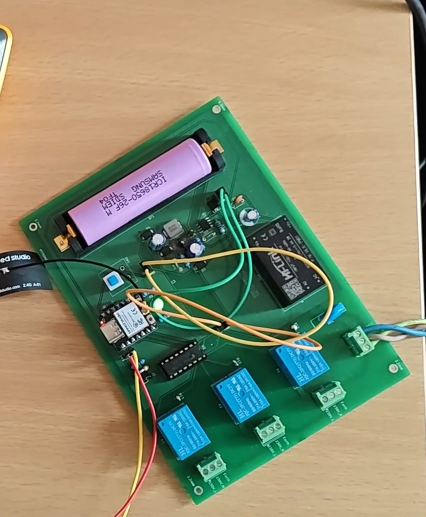
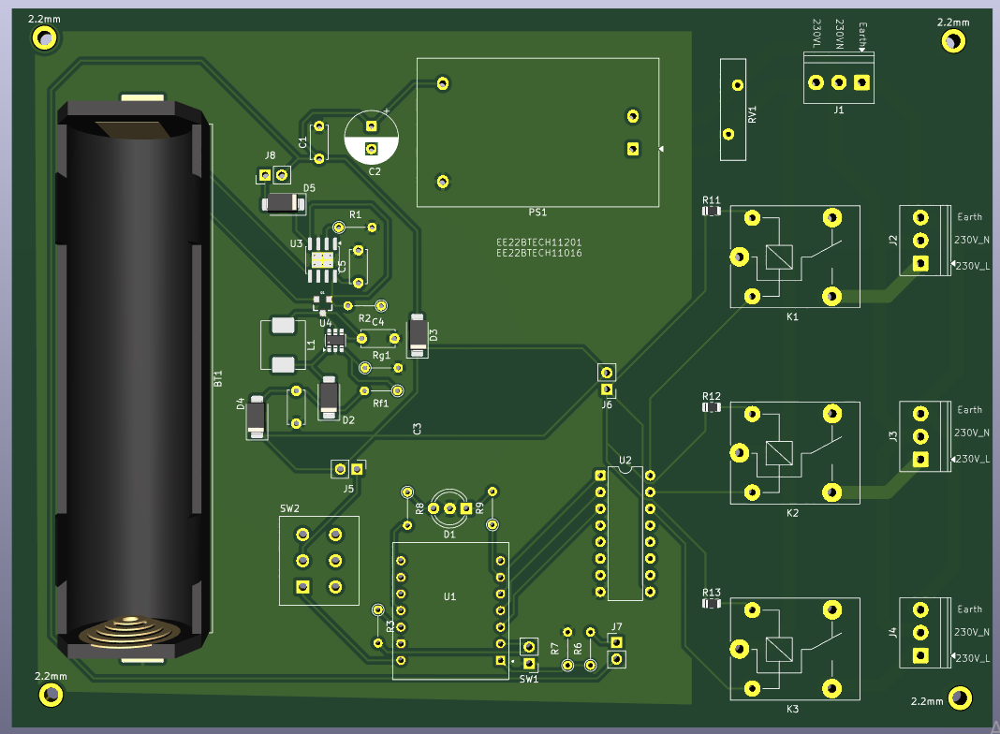
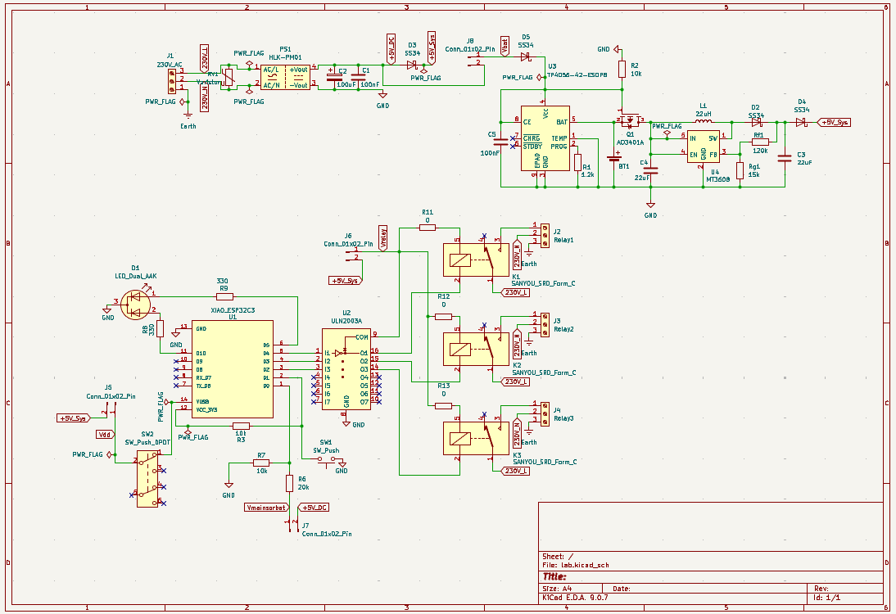
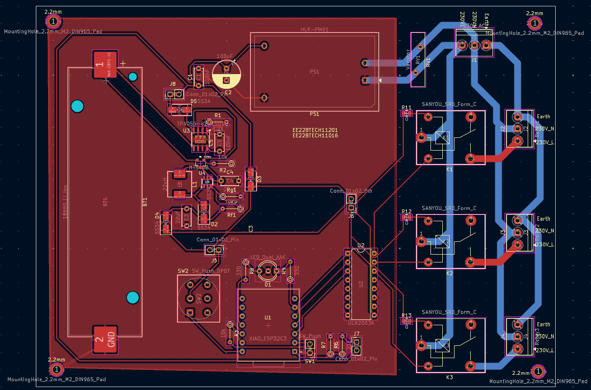
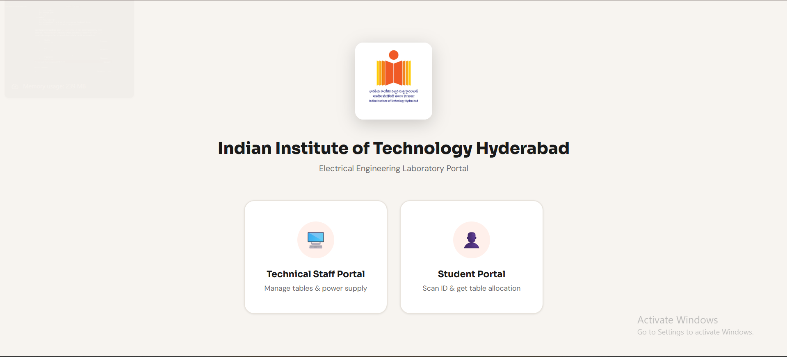
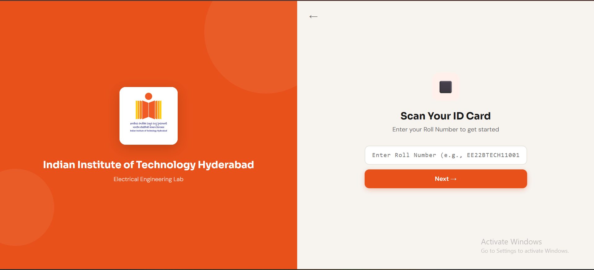
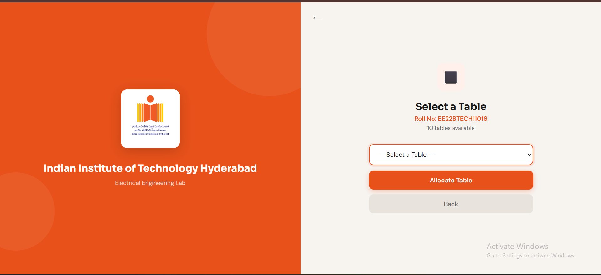
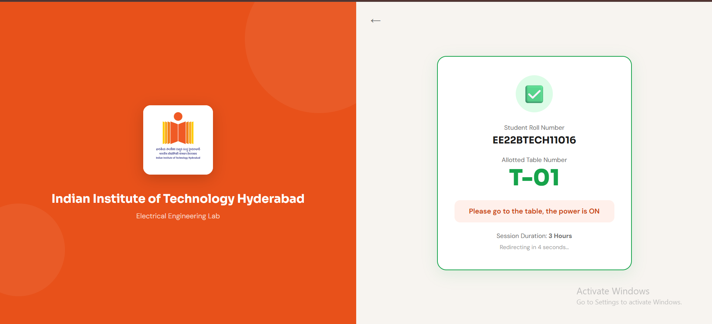
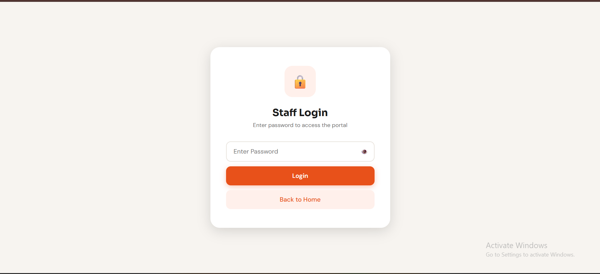
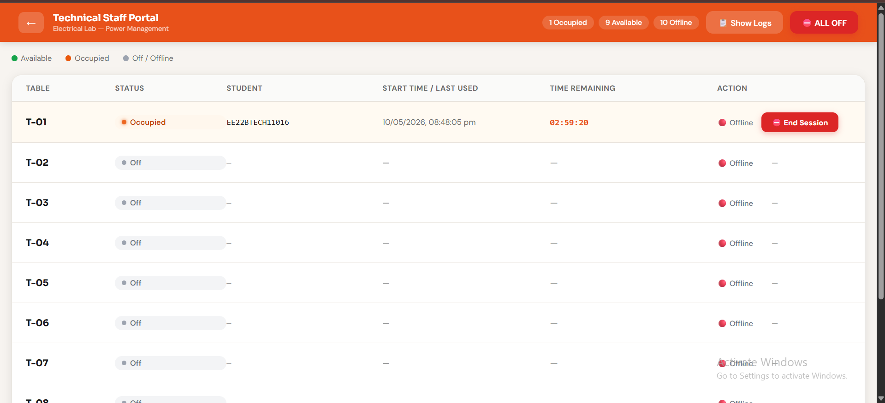

<div align="center">

# Centralized Power Distribution System

### IIT Hyderabad — Electrical Engineering Laboratory

*An IoT-based smart power management system for EE lab workbenches. Students request table power through a web portal by entering their roll number; lab staff monitor and control all 10 tables in real time from a central dashboard — powered by ESP32-C3 microcontrollers, Firebase Realtime Database, and automatic 18650 Li-Ion battery backup.*

<br>



<br>

[](#)
[](#)
[](#)

</div>

---

## Table of Contents

1. [Introduction & Overview](#1-introduction--overview)
2. [Features](#2-features)
3. [System Architecture](#3-system-architecture)
4. [How It Works](#4-how-it-works)
5. [Hardware Design](#5-hardware-design)
6. [Software Design & Frameworks](#6-software-design--frameworks)
7. [Repository Structure](#7-repository-structure)
8. [Setup & Workflow](#8-setup--workflow)
9. [How to Run](#9-how-to-run)
10. [Portal Walkthrough — Screenshots](#10-portal-walkthrough--screenshots)
11. [Demo Video](#11-demo-video)
12. [Applications](#12-applications)
13. [Challenges Faced](#13-challenges-faced)
14. [Future Improvements](#14-future-improvements)
15. [Team](#15-team)

---

## 1. Introduction & Overview

University EE labs share 10 workbenches between many student groups. Today, a lab staff member must physically walk to each table to switch power on or off, and there is no record of who used which table, when, or for how long. Power is sometimes left ON after students leave, equipment runs unattended, and there is no centralized emergency cut-off.

The **Centralized Power Distribution System (CPDS)** eliminates this entirely. A custom PCB at each table drives three relay-controlled socket outlets under the control of a cloud-connected **Seeed Studio XIAO ESP32-C3**. A **React + Firebase** web portal provides two portals in one URL — a **Student Portal** where students type their roll number and choose an available table, and a **Staff Dashboard** where one instructor sees all 10 tables live and can cut any session in one click.

Communication flows through **Firebase Realtime Database** — the portal writes `isOn: true` to a table's path, the ESP32 there reads it within 2 seconds and closes the relays, and the sockets go live. All events are logged with timestamps. A built-in 18650 Li-Ion battery automatically takes over if mains power is lost, and a physical emergency button on each table cuts power instantly without needing a network round-trip.

---

## 2. Features

| Feature | Description |
|---|---|
| **Manual Roll Number Entry** | Students type their roll number in the portal — no QR scan, no app install, works on any browser |
| **Live Table Availability** | Student portal dropdown shows only currently available (unoccupied) tables in real time |
| **3-Hour Session Timer** | Each table allocation runs for 3 hours; staff dashboard shows live countdown per table |
| **Staff Dashboard** | Live grid of all 10 tables: status badge, student roll, session start time, countdown, power source, and action button |
| **Firebase Real-Time Sync** | Portal ↔ ESP32 changes propagate in under 2 seconds via Firebase `onValue` listeners |
| **Mains / Battery Auto-Failover** | ADC on GPIO D0 monitors mains via voltage divider; AO3401A P-MOSFET switches to 18650 + MT3608 boost when mains drops |
| **Physical Emergency Button** | NO push button on each table — immediately cuts all 3 relays and writes to Firebase without waiting for a network response |
| **Bi-Color LED Indicator** | Green = mains present & running; Red = battery mode / error / boot |
| **10-Second Heartbeat** | Each ESP32 writes `lastSeen` every 10 s; dashboard shows 🔴 Offline if heartbeat stops |
| **Activity Log Panel** | Every session start, end, expiry, emergency, and power event is logged to Firebase with a human-readable timestamp |
| **All-Off Emergency Button** | Staff button with confirmation modal cuts power to all 10 tables simultaneously |
| **Session Auto-Expiry** | Dashboard `Countdown` component auto-calls `deallocateTable()` when a 3-hour session reaches zero |
| **Recent Allocations Table** | Student roll-entry page shows the last 5 active allocations live — helps students see if their table is already taken |

---

## 3. System Architecture

```
┌──────────────────────────────────────────────────────────────────────┐
│                          Firebase Cloud                              │
│                                                                      │
│   Realtime Database                    Firebase Hosting              │
│   ────────────────                     ────────────────              │
│   tables/T-XX/isOn          ◄──────    React Web Portal             │
│   tables/T-XX/studentRoll              ├── Student Portal            │
│   tables/T-XX/starttimeLabel  ──────►  │   Roll number entry         │
│   tables/T-XX/sessionEnd               │   Table selection           │
│   power/T-XX/source         ◄──────    │   Confirmation screen       │
│   power/T-XX/lastSeen                  └── Staff Dashboard           │
│   logs/{id}                                All 10 tables live        │
│   logCount                                 End Session / All Off     │
└──────────────────────┬───────────────────────────────────────────────┘
                       │  Wi-Fi  IEEE 802.11 b/g/n
         ┌─────────────┼──────────────┐
         │             │              │
   ┌─────▼──────┐ ┌────▼───────┐ ┌──▼──────────┐
   │  Table T-01│ │ Table T-02 │ │  Table T-10  │
   │ XIAO ESP32 │ │ XIAO ESP32 │ │  XIAO ESP32  │
   │ Custom PCB │ │ Custom PCB │ │  Custom PCB  │
   │ ULN2003APG │ │ ULN2003APG │ │  ULN2003APG  │
   │ 3× Relays  │ │ 3× Relays  │ │  3× Relays   │
   │ HLK-PM01   │ │ HLK-PM01   │ │  HLK-PM01    │
   │ 18650+MT36 │ │ 18650+MT36 │ │  18650+MT36  │
   │ Emerg Btn  │ │ Emerg Btn  │ │  Emerg Btn   │
   │ Bi-clr LED │ │ Bi-clr LED │ │  Bi-clr LED  │
   └────────────┘ └────────────┘ └──────────────┘
```

**Data flow summary:**
- Student submits roll number → `allocateTable(id, roll)` → Firebase `tables/T-XX/isOn = true`
- ESP32 polls Firebase every 2 s → reads `isOn = true` → `setRelays(true)` → sockets live
- ESP32 writes `power/T-XX/lastSeen` every 10 s → dashboard flags Offline if missed
- Staff clicks End Session → `deallocateTable(id)` → Firebase `isOn = false` → ESP32 reads → relays open

---

## 4. How It Works

### Student Flow

```
Student opens web portal on any browser
              │
              ▼
Home Page  →  clicks "Student Portal" card
              │
              ▼
Roll Number Entry page (StudentScanPage):
  - Text input: type roll number e.g. "EE22BTECH11001"  →  press Next / Enter
  - Recent Allocations table shows last 5 active sessions live from Firebase
              │
              ▼
Table Selection page (StudentSelectPage):
  - Dropdown populated in real time with ONLY unoccupied tables
  - Occupied tables are excluded automatically
  - If all tables are full → yellow warning banner appears
  - Student selects table  →  "Allocate Table"
              │
              ▼
allocateTable("T-03", "EE22BTECH11001") writes to Firebase:
     tables/T-03/isOn            = true
     tables/T-03/studentRoll     = "EE22BTECH11001"
     tables/T-03/starttimeLabel  = "07/05/2026, 03:45:12 pm"
     tables/T-03/sessionEnd      = <epoch ms + 3 hours>
     tables/T-03/sessionEndLabel = "07/05/2026, 06:45:12 pm"
     logs/{n}                    = { type: "session_start", ... }
              │
              ▼
Confirmation page (StudentConfirmPage):
  - Shows roll number + table number (large green)
  - "Power is ON — please go to the table"
  - Session duration: 3 Hours
  - Auto-redirects to home in 5 seconds
              │
              ▼
ESP32 at T-03: polls Firebase (every 2 s)
  reads isOn = true  →  setRelays(true)
  D4, D3, D2 HIGH  →  ULN2003 drives coils  →  relay contacts close  →  sockets LIVE
  Green LED ON
```

### Staff Flow

```
Staff opens portal  →  "Technical Staff Portal"  →  Password entry
              │
              ▼
StaffLoginPage:
  - Password compared against hardcoded STAFF_PASSWORD
  - Correct  →  sessionStorage.setItem("staffAuth","true")  →  navigate to dashboard
  - Wrong    →  inline error message, password cleared
              │
              ▼
StaffDashboardPage (auth guard: redirects if staffAuth not set):
  - Three Firebase listeners started on mount:
      subscribeToTables  →  setTables state
      subscribeToPower   →  setPower  state
      subscribeToLogs    →  setLogs   state
  - Cleanup: all three unsubscribed on unmount
              │
              ▼
Dashboard header shows live stats chips: "3 Occupied  |  6 Available  |  1 Offline"

Dashboard table row per T-01…T-10:
  [Table ID] [Status badge] [Student Roll] [Start Time] [Countdown] [Power badge] [Action]
              │
              ▼
Staff clicks "⛔ End Session" on T-03:
  →  deallocateTable("T-03", "staff_ended")
  →  Firebase: isOn=false, lastUsed=<now>
  →  log: { type:"session_end", message:"Table T-03 session ended — reason: staff_ended" }
  →  ESP32 reads isOn=false on next 2s poll  →  setRelays(false)  →  sockets dead
              │
              ▼
Staff clicks "⛔ ALL OFF"  →  confirmation modal appears
  →  "Yes, ALL OFF"  →  allTablesOff()
  →  Promise.all: all 10 tables set isOn=false simultaneously
  →  log: { type:"staff", message:"ALL TABLES turned OFF by staff" }
```

### Emergency Button (Hardware)

```
Student presses NO push button on table edge (GPIO D1, INPUT_PULLUP)
              │
              ▼
ESP32 loop: digitalRead(PIN_EMERG_BTN) = LOW
50 ms debounce elapsed, btnWasPressed was false
              │
              ▼
emergTripped = true
setRelays(false) IMMEDIATELY — no Firebase wait
D4, D3, D2 → LOW  →  relay contacts open  →  sockets DEAD
              │
              ▼
Firebase writes (best-effort):
  firebaseDeallocate("emergency_button")  →  tables/T-XX/isOn = false
  firebaseAddLog("Emergency button pressed — relays OFF", "emergency")
Red LED ON
              │
              ▼
Button released: btnWasPressed=false, emergTripped=false (auto-reset latch)
Table ready for next student
```

### Mains Failure & Battery Failover

```
Mains power drops  →  HLK-PM01 output falls
              │
              ▼
ADC on GPIO D0 reads voltage divider:  analogRead(PIN_MAINS_ADC) < 500
mains (bool) becomes false, lastMailsState was true → change detected
              │
              ▼
updateLED(false): Green OFF, Red ON
firebaseSetPower("battery"):
  power/T-XX/source   = "battery"
  power/T-XX/lastSeen = <readable time>
              │
              ▼
If relays were ON when mains dropped:
  setRelays(false)
  firebaseDeallocate("mains_lost")
  firebaseAddLog("Mains power lost — relays turned OFF", "power")
              │
              ▼
AO3401A P-MOSFET hardware path (automatic, no firmware needed):
  HLK-PM01 rail drops  →  MOSFET gate control switches
  18650 Li-Ion  →  MT3608 boost converter  →  5V rail maintained
  ESP32 and relays stay powered
              │
              ▼
Mains restored: ADC rises above 500, mains=true again
updateLED(true): Green ON, Red OFF
firebaseSetPower("mains")
firebaseAddLog("Mains power restored", "power")
```

---

## 5. Hardware Design

### PCB Overview

Custom 2-layer PCB designed in **KiCad 9**. One board per lab table — 10 boards total.



| Parameter | Value |
|---|---|
| Design Tool | KiCad 9.x |
| Layers | 2 — F.Cu (signal + power) / B.Cu (High Voltage AC Power) |
| Min trace width | 0.3 mm signal / 1.5 mm mains |
| Mains isolation | 3 mm creepage gap + PCB slot (Edge.Cuts) |
| Surface finish | HASL |
| Board thickness | 1.6 mm |
| Copper weight | 1 oz (35 µm) |

### Schematic



### PCB Layout



### Pin Map — XIAO ESP32-C3

| Label | GPIO | Direction | Function |
|---|---|---|---|
| D0 | 2 | INPUT (ADC 12-bit) | Voltage divider output — mains sense, threshold 500 |
| D1 | 3 | INPUT (INPUT_PULLUP) | Emergency button — NO contact, active LOW |
| D2 | 4 | OUTPUT | ULN2003 I3 → Relay 3 — HIGH = relay energised = socket ON |
| D3 | 5 | OUTPUT | ULN2003 I2 → Relay 2 |
| D4 | 6 | OUTPUT | ULN2003 I1 → Relay 1 |
| D5 | 7 | OUTPUT | Green LED — HIGH = mains present, no error |
| D10 | 10 | OUTPUT | Red LED — HIGH = battery mode / error / boot |

### Power Architecture

```
230V AC Mains
     │
 [Varistor MOV]   ← surge protection
     │
 [HLK-PM01]       ← isolated SMPS, 230VAC → 5V DC
     │
     ├──────────── 5V Rail ─────────────────────────────────────┐
     │                                                          │
     │         [TP4056 charger] ←─── charges 18650 from 5V     │
     │                │                                         │
     │           [18650 Li-Ion]                                 │
     │                │                                         │
     │           [MT3608 Boost] → 5V                            │
     │                │                                      [AO3401A P-MOSFET]
     │                └─────────────────────────────────────────┘
     │                                                          │
     └──────────────────────────── 5V Supply Rail ─────────────┘
                                         │
                              [ESP32-C3 + ULN2003 + 3× Relays]
```

- **Normal:** HLK-PM01 supplies the 5V rail; AO3401A gate held high → MOSFET OFF → battery path blocked
- **Mains failure:** HLK-PM01 drops; AO3401A switches → MT3608 boosts 18650 → 5V rail sustained
- **Charging:** TP4056 charges 18650 from the 5V mains rail while mains is present
- **Protection:** SS34 Schottky diodes on all relay flyback paths; Varistor on AC input for surge events

### Bill of Materials (BOM)

| # | Component | Description | MPN | Price (Rs.) | Qty |
|---|---|---|---|---|---|
| 1 | Seeed Studio XIAO ESP32-C3 | Wi-Fi microcontroller, USB-C, castellated | Generic | 600 | 1 |
| 2 | 5V 1-Channel Relay Module | SRD-05VDC-SL-C coil, 10A contacts | SRD-05VDC-SL-C | 33 | 3 |
| 3 | ULN2003APG (Toshiba) | 50V / 500mA 7-ch Darlington array — relay driver | ULN2003APG | 19 | 1 |
| 4 | Momentary Push Switch | NO contact, active-low emergency button | TSD001B07018A | 20 | 1 |
| 5 | Hi-Link HLK-PM01 | 230VAC → 5V / 3W isolated SMPS | HLK-PM01 | 200 | 1 |
| 6 | 18650 Li-Ion Battery | 3.7V, 2500mAh backup cell | INR18650-25P | 81 | 1 |
| 7 | 18650 Battery Holder | SMD/SMT single cell | 1042P | 33 | 1 |
| 8 | TP4056 Charging Module | Adjustable 1A Li-Ion charger | TP4056 | 14 | 1 |
| 9 | MT3608 Boost Converter | 2A max DC-DC step-up module | MT3608| 36 | 1 |
| 10 | Bi-Color LED | 5mm Red/Green dual indicator | XL-A524SURSYGW | 3 | 1 |
| 11 | 6-Pin DPDT Self-Lock Switch | Latching power switch | — | 6 | 1 |
| 12 | AO3401A MOSFET | P-channel SOT-23, mains/battery path switch | AO3401A | 4 | 1 |
| 13 | 3-Pin Screw Terminal | 3.5mm pitch — mains & load connections | XY302V-3.5-3P | 12 | 4 |
| 14 | SS34 Schottky Diode | 3A / 40V — relay flyback + path blocking | — | 7 | 4 |
| 15 | 22µH Inductor SMD | MT3608 boost converter inductor | ASPI-0630LR-220M-T15 | 70 | 1 |
| 16 | Varistor D15.5mm P7.5mm | MOV surge protection on AC input | 561KD10J | 14 | 1 |
| 17 | PCB | Total PCB manufacturing cost  | — | 2936 | 1 |

Total cost  = Rs. 4211 /-  per  Table.

### Component Footprints

| Component | KiCad Footprint | Library |
|---|---|---|
| XIAO ESP32-C3 | `SeeedStudio_XIAO_ESP32C3` | Custom (castellated pads) |
| Relay Module | `Relay_THT:HF41F` | Standard |
| ULN2003APG | `Package_DIP:DIP-16_W7.62mm` | Standard |
| Momentary Push Switch | `Button_Switch_THT:SW_PUSH_6mm` | Standard |
| HLK-PM01 | `Converter_ACDC:HLK-PM01` | Standard |
| 18650 Battery Holder | `BatteryHolder_THT:BatteryHolder_Keystone_1042P` | Standard |
| TP4056 Module | `Module_TP4056` | Custom |
| MT3608 Boost Module | `Module_MT3608` | Custom |
| AO3401A MOSFET | `mosfet.pretty:SOT23-3` | Custom — included in `kicad/mosfet.pretty/` |
| Bi-Color LED | `LED_THT:LED_D5.0mm_2pin` | Standard |
| 3-Pin Screw Terminal | `TerminalBlock_Phoenix:MKDS_3-3.5` | Standard |
| 100µF Cap DIP | `Capacitor_THT:CP_Radial_D8.0mm_P3.50mm` | Standard |
| 22µF Cap DIP | `Capacitor_THT:CP_Radial_D6.3mm_P2.50mm` | Standard |
| SS34 Schottky Diode | `Diode_THT:D_DO-201AD` | Standard |
| 22µH Inductor SMD | `Inductor_SMD:L_Bourns_SRR1260` | Standard |
| All THT Resistors | `Resistor_THT:R_Axial_DIN0207_L6.3mm_D2.5mm_P7.62mm` | Standard |
| Varistor | `Varistor_THT:RV_D15.5mm_P7.5mm` | Standard |

> **Note:** The `mosfet.pretty/` folder is included in `kicad/` as a relative-path library. The project will open without missing footprint errors on any machine as long as the folder structure is kept intact.

---

## 6. Software Design & Frameworks

### Tech Stack

| Layer | Technology | Details |
|---|---|---|
| Frontend | React 18.2 | `create-react-app` scaffold |
| Routing | React Router DOM v6.21 | `BrowserRouter` + `Routes` + `Route` |
| Database | Firebase Realtime Database v10.7 | Real-time `onValue` listeners + `set` / `update` writes |
| Auth | Session-based (hardcoded password) | `sessionStorage.setItem("staffAuth","true")` |
| Hosting | Firebase Hosting | Deployed via `firebase deploy` |
| Firmware | Arduino / C++ on ESP32-C3 | `Firebase_ESP_Client` by Mobizt, `ArduinoJson` by Blanchon |

### Page Map

| Route | Component | What it does |
|---|---|---|
| `/` | `HomePage` | Landing — two hover cards: Technical Staff Portal & Student Portal |
| `/student/scan` | `StudentScanPage` | Roll number text input + Enter key support + recent allocations live table |
| `/student/select` | `StudentSelectPage` | Live dropdown of available tables + "Allocate Table" button + loading state |
| `/student/confirm` | `StudentConfirmPage` | Success card — roll, table (large green), "power is ON", 5-second countdown redirect |
| `/staff/login` | `StaffLoginPage` | Password input with show/hide toggle — stores auth in sessionStorage |
| `/staff/dashboard` | `StaffDashboardPage` | Full dashboard — 3 Firebase listeners, 10-table grid, logs panel, ALL OFF modal |

### Firebase Database Schema

```json
{
  "tables": {
    "T-01": {
      "isOn": true,
      "studentRoll": "EE22BTECH11001",
      "starttimeLabel": "07/05/2026, 03:45:12 pm",
      "sessionEnd": 1715079912000,
      "sessionEndLabel": "07/05/2026, 06:45:12 pm"
    }
  },
  "power": {
    "T-01": {
      "source": "mains",
      "lastSeen": "07/05/2026, 03:50:00 pm"
    }
  },
  "logs": {
    "1": {
      "message": "Table T-01 allocated to student EE22BTECH11001",
      "tableId": "T-01",
      "type": "session_start",
      "timestamp": "07/05/2026, 03:45:12 pm"
    }
  },
  "logCount": 1
}
```

### Key Functions — `database.js`

| Function | Description |
|---|---|
| `subscribeToTables(cb)` | `onValue` on `tables/` — returns Firebase unsubscribe fn; called in useEffect cleanup |
| `subscribeToPower(cb)` | `onValue` on `power/` — same pattern |
| `subscribeToLogs(cb, limit)` | `onValue` on `logs/` with `orderByKey + limitToLast(100)`, sorted newest-first |
| `allocateTable(id, roll)` | Writes `isOn=true`, roll, start time label, sessionEnd epoch + label; adds `session_start` log |
| `deallocateTable(id, reason)` | Writes `isOn=false`, `lastUsed`; adds `session_end` or `expire` log based on reason |
| `allTablesOff()` | `Promise.all` over all 10 table deallocations; adds single `staff` log |
| `clearLogs()` | Sets `logs` and `logCount` to null/0 |
| `clearAllData()` | Called on `App.js` mount — resets all tables to `isOn:false` and power to `offline` |
| `addLog({message, tableId, type})` | Reads `logCount`, increments, writes to `logs/{n}` with human timestamp |
| `toReadable(ms)` | Formats epoch ms → `"DD/MM/YYYY, HH:MM:SS am/pm"` (matches ESP32 output) |

### ESP32 Firmware — Timing Constants

| `#define` | Value | Purpose |
|---|---|---|
| `MAINS_THRESHOLD` | 500 (ADC counts) | 12-bit ADC reading below this = mains lost |
| `DEBOUNCE_MS` | 50 ms | Emergency button software debounce window |
| `FIREBASE_POLL_MS` | 2000 ms | Interval between Firebase `getBool` reads for `isOn` |
| `HEARTBEAT_INTERVAL_MS` | 10000 ms | Interval between `lastSeen` + power source writes |

### App.js — Startup Behaviour

On every portal load, `App.js` calls `clearAllData()` in a `useEffect`. This resets all 10 tables to `isOn: false` and all power entries to `source: "offline"` — ensuring a clean slate each time staff open the portal.

---

## 7. Repository Structure

```
centralized-power-distribution/
│
├── README.md                              ← This file
├── PCB.pdf                                ← Hardware reference (schematic, BOM, footprints, gerbers)
├── .gitattributes
│
├── kicad/                                 ← All KiCad design files
│   ├── lab.kicad_pro                      ← Open this in KiCad 7 to load the full project
│   ├── lab.kicad_sch                      ← Complete schematic
│   ├── lab.kicad_pcb                      ← PCB layout with copper pours and component placements
│   ├── lab.kicad_prl                      ← Project-level layer/render preferences
│   ├── New_Library.kicad_sym              ← Custom schematic symbols library
│   ├── mosfet.kicad_sym                   ← AO3401A schematic symbol
│   ├── mosfet.pretty/
│   │   └── SOT23-3.kicad_mod              ← Custom AO3401A PCB footprint (SOT-23-3, 0.95mm pitch)
│   ├── sym-lib-table                      ← Symbol library path references
│   ├── fp-lib-table                       ← Footprint library path references
│   └── lab_output/                        ← Gerber files — ZIP this folder and send to manufacturer
│       ├── lab-F_Cu.gbr                   ← Front copper traces
│       ├── lab-B_Cu.gbr                   ← Back copper ground plane
│       ├── lab-F_Mask.gbr                 ← Front solder mask
│       ├── lab-B_Mask.gbr                 ← Back solder mask
│       ├── lab-F_Silkscreen.gbr           ← Front silkscreen labels
│       ├── lab-B_Silkscreen.gbr           ← Back silkscreen
│       ├── lab-F_Paste.gbr                ← Front solder paste
│       ├── lab-B_Paste.gbr                ← Back solder paste
│       ├── lab-Edge_Cuts.gbr              ← Board outline + isolation PCB slot
│       ├── lab-PTH.drl                    ← Plated through-hole drill file
│       ├── lab-NPTH.drl                   ← Non-plated through-hole drill file
│       └── lab-job.gbrjob                 ← Gerber job metadata file
│
├── esp32-code/
│   └── lab_controller_v3.ino          ← Full ESP32-C3 Arduino firmware (v3.0)
│
├── web-portal/
│   ├── package.json                       ← React 18 + React Router v6 + Firebase v10 dependencies
|   ├── package-lock.json                  ← Exact locked dependency versions for reproducible npm installs
|   ├── README.md                          ← Setup flow for website and esp32
|   ├── public/
|   |   ├── index.html                     ← Basic frame for portal 
|   ├── esp32_firmware/
│   |   ├── lab_controller_v3.ino          ← Full ESP32-C3 Arduino firmware (v3.0) (same as above used esp32-code)
│   └── src/
│       ├── App.js                         ← BrowserRouter root — 6 routes + clearAllData on mount
│       ├── index.js                       ← React DOM entry point
│       ├── index.css                      ← CSS variables (--orange, --bg, --border, etc.) + globals
│       ├── iit-logo.png                   ← IITH logo used in HomePage and IITBrand panel
│       ├── firebase/
│       │   ├── config.js                  ← Firebase app init — reads from .env variables
│       │   └── database.js                ← All Firebase helper functions and subscriptions
│       ├── pages/
│       │   ├── HomePage.jsx               ← Landing page — two portal cards
│       │   ├── StudentScanPage.jsx        ← Roll number input + recent allocations table
│       │   ├── StudentSelectPage.jsx      ← Available table dropdown + Allocate button
│       │   ├── StudentConfirmPage.jsx     ← Success card + 5s countdown redirect
│       │   ├── StaffLoginPage.jsx         ← Password login + sessionStorage auth
│       │   └── StaffDashboardPage.jsx     ← Full dashboard — grid, logs, ALL OFF modal
│       └── components/
│           └── IITBrand.jsx               ← Left-panel branding strip with logo + lab name
│
└── media/
    ├── demo_video.mp4                     ← Full system demonstration video
    ├── screenshots/
    │   ├── 01_home_page.png               ← Home page — two portal cards
    │   ├── 02_student_roll_entry.png      ← Roll number text input + recent allocations
    │   ├── 03_student_table_select.png    ← Available tables dropdown
    │   ├── 04_student_confirmation.png    ← Confirmation card with table number
    │   ├── 05_staff_login.png             ← Staff password login screen
    │   └── 06_staff_dashboard.png         ← Full dashboard — all 10 tables live
    └── hardware/
        ├── system_overview.jpg            ← Wide shot of full table setup
        ├── schematic.png                  ← KiCad schematic export
        ├── pcb.png                        ← KiCad 3D render
        └── pcb_3d_top.png                 ← KiCad 3D viewer top render (raytracing)
```

---

## 8. Setup & Workflow

### Prerequisites

- Node.js ≥ 16 and npm
- Arduino IDE 2.x
- KiCad 9.x (for PCB files)
- A Firebase project with Realtime Database enabled

### Step 1 — Firebase Project

1. Go to [console.firebase.google.com](https://console.firebase.google.com) → **Create project**
2. Enable **Realtime Database** — choose Asia Southeast 1 for lowest latency from India
3. Set temporary development rules:
   ```json
   { "rules": { ".read": true, ".write": true } }
   ```
4. Copy your **Web API Key** from Project Settings → General
5. Copy your **Database URL** from the Realtime Database panel
6. Create a **Legacy Database Secret** from Project Settings → Service Accounts → Database Secrets — this is needed by the ESP32

### Step 2 — Web Portal

```bash
cd web-portal/
npm install
```

#### File 1 — Firebase credentials
Open ``` web-portal/src/firebase/config.js ``` and replace the values directly:

```js
const firebaseConfig = {
  apiKey:            "YOUR_WEB_API_KEY",
  authDomain:        "YOUR_PROJECT_ID.firebaseapp.com",
  databaseURL:       "https://YOUR_PROJECT_ID-default-rtdb.asia-southeast1.firebasedatabase.app",
  projectId:         "YOUR_PROJECT_ID",
  storageBucket:     "YOUR_PROJECT_ID.appspot.com",
  messagingSenderId: "YOUR_SENDER_ID",
  appId:             "YOUR_APP_ID"
};
```

#### File 2 — Staff password
Open ``` web-portal/src/pages/StaffLoginPage.jsx ``` and find line near the top:
```js
const STAFF_PASSWORD = "your_chosen_password";
```

### Step 3 — ESP32 Firmware

**Install Arduino libraries** (Tools → Manage Libraries):
- `Firebase ESP Client` by Mobizt
- `ArduinoJson` by Benoit Blanchon

**Add XIAO board package** — File → Preferences → Additional Boards Manager URLs:
```
https://raw.githubusercontent.com/espressif/arduino-esp32/gh-pages/package_esp32_index.json
```
Then install `esp32 by Espressif Systems` in Boards Manager.

**Edit the 5 marked lines** at the top of `lab_controller_v3.ino`:
```cpp
#define WIFI_SSID         "YOUR_WIFI_SSID"        // your Wi-Fi network name
#define WIFI_PASSWORD     "YOUR_WIFI_PASSWORD"     // your Wi-Fi password
#define TABLE_ID          "T-01"                   // change per board: T-01 … T-10
#define FIREBASE_API_KEY  "YOUR_WEB_API_KEY"       // from Firebase Project Settings → General
#define DATABASE_URL      "YOUR_DATABASE_URL"      // from Firebase Realtime Database panel
```

Also update the legacy token:
```cpp
config.signer.tokens.legacy_token = "YOUR_DATABASE_SECRET"; // from Project Settings → Service Accounts → Database Secrets
```

**Arduino IDE board settings:**

| Setting | Value |
|---|---|
| Board | XIAO_ESP32C3 |
| Upload Speed | 921600 |
| USB CDC On Boot | Enabled |

Flash each of the 10 boards with a unique `TABLE_ID` (`T-01` through `T-10`). After flashing, open Serial Monitor at **115200 baud** — first lines should be:
```
=== IIT-H EE Lab ESP32 v3.0 ===
Table: T-01
[WiFi] Connecting to YOUR_SSID
[Firebase] Connected OK
[Boot] Ready.
```

---

## 9. How to Run

### Web Portal — Development

```bash
cd web-portal/
npm start
# Opens at http://localhost:3000
```

### Web Portal — Production (Firebase Hosting)

```bash
npm run build
npm install -g firebase-tools
firebase login
firebase init hosting
# → Public dir: build
# → Configure as SPA: Yes
# → Overwrite build/index.html: No
firebase deploy
# Live at https://your-project.web.app
```

### ESP32 Boards

1. Connect XIAO ESP32-C3 via USB-C
2. Set the correct `TABLE_ID` for this board
3. Select the correct port in Arduino IDE
4. Click Upload (Ctrl+U)
5. Verify serial output shows correct TABLE_ID
6. Repeat for all 10 boards (T-01 → T-10)

Once all boards are powered and connected to Wi-Fi, the staff dashboard will show ⚡ Mains for each online table within 10 seconds (first heartbeat).

---

## 10. Portal Walkthrough — Screenshots

### Home Page



The landing page displays the IIT Hyderabad logo, university name, and lab title. Two clickable cards navigate to the Staff and Student portals. Cards lift and border turns orange on hover.

---

### Student — Roll Number Entry



Students type their roll number (e.g. `EE22BTECH11001`) and press **Next** or hit Enter. A "Recent Allocations" table below the input shows the last 5 active sessions — roll number, table, and date — pulled live from Firebase.

---

### Student — Table Selection



A dropdown lists only currently unoccupied tables in real time. The page shows how many tables are available. If all tables are occupied, a yellow warning banner appears instead of the dropdown. Student selects a table and clicks **Allocate Table**.

---

### Student — Confirmation



A green-bordered card confirms the allocation: roll number, allotted table number displayed large in green, "please go to the table, the power is ON", and session duration (3 hours). The page automatically redirects back to home after 5 seconds.

---

### Staff — Login



A centered card with a lock icon and a password field. The 👁️ button toggles password visibility. Correct password stores `staffAuth` in `sessionStorage` and navigates to the dashboard. Wrong password shows an inline red error.

---

### Staff — Dashboard



The full control centre. A sticky orange header shows "Technical Staff Portal", live status chips (Occupied / Available / Offline counts), a **Show Logs** toggle, and the red **⛔ ALL OFF** emergency button.

The main table has one row per lab table (T-01 to T-10), each showing:
- **Table ID** — bold identifier
- **Status badge** — 🟢 Available / 🟠 Occupied (pulsing dot) / ⚫ Off
- **Student Roll** — monospace, shown only when occupied
- **Start Time** — human-readable session start timestamp
- **Time Remaining** — live `HH:MM:SS` countdown (turns red in last 10 minutes)
- **Power Source** — ⚡ Mains / 🔋 Battery / 🔴 Offline
- **⛔ End Session** — red button visible only for occupied tables

The **Activity Logs** panel (toggled from header) shows all events with type-coded badges: SESSION START / SESSION END / EXPIRE / EMERGENCY / POWER / STAFF. A "Clear Logs" button resets the log in Firebase.

---

## 11. Demo Video

Watch the demo video here: [Demo Video](https://drive.google.com/file/d/1mhNnTaNkejmopCFQ-6PinY2lMFn2YFTQ/view?usp=sharing))

**What the demo shows:**
1. Student enters roll number → selects table → confirmation screen → sockets go live
2. Staff dashboard updates in real time — table flips to Occupied with live countdown
3. Staff ends session from dashboard → relays cut → table returns to Available
4. Emergency button press on table → immediate relay cutoff → dashboard updates to Off
5. Mains disconnected → battery failover → 🔋 Battery badge appears on dashboard

---

## 12. Applications

| Domain | Use Case |
|---|---|
| University EE Labs | Controlled, authenticated, logged power access for shared workbenches — primary use case |
| School Electronics Labs | Staff-supervised power control preventing unsupervised student equipment use |
| Makerspaces | Per-member metered power access with session logging and time limits |
| Industrial Test Stations | Remote power management for shared test benches in manufacturing or R&D environments |
| Exam / Assessment Centres | Timed, per-seat power allocation with automatic expiry for practical examinations |

---

## 13. Challenges Faced

| # | Challenge | Category | Resolution |
|---|---|---|---|
| 1 | ADC mains-sense gave noisy readings — false failover triggers every few seconds | Hardware | Added 100µF + 22µF capacitors across voltage divider output to GND; 5-consecutive-reading hysteresis in firmware |
| 2 | Relay chatter during mains → battery transition (~80 ms power sag caused ESP32 brownout) | Hardware | Added 100µF bulk capacitor directly on 5V rail near ESP32 VCC pin — bridges the switchover gap |
| 3 | AO3401A gate drive: ESP32 3.3V GPIO cannot fully turn OFF a 5V P-channel MOSFET | Hardware | Added NPN transistor level-shift stage; 120kΩ pull-up to 5V rail for proper gate-high state |
| 4 | KiCad standard library had no AO3401A SOT-23-3 footprint at correct 0.95mm pin pitch | Hardware | Created `mosfet.pretty` custom footprint library — included in the repo |
| 5 | Initial PCB layout violated IPC-2221 mains creepage distance between AC and DC traces | Hardware | Redesigned layout with 3mm gap + physical PCB slot in Edge.Cuts layer |
| 6 | Firebase streaming (persistent HTTPS) connection dropped frequently on lab Wi-Fi idle timeout | Firmware | Switched to 2-second polling with `Firebase.RTDB.getBool()` — stable, latency acceptable for power control |
| 7 | Emergency button mechanical bounce caused 3–5 spurious `LOW` reads per single press | Firmware | 50 ms software debounce + `btnWasPressed` latch; latch clears only on release (HIGH), not press |
| 8 | `onValue` listeners stacked on re-navigation — 3 → 6 → 9 active listeners after 3 visits to dashboard | Software | `useEffect` cleanup returns and calls all three Firebase unsubscribe functions on component unmount |
| 9 | Session countdown timer drifted 5–10 s per hour using `setInterval` decrement counter | Software | Changed to `Math.max(0, sessionEnd - Date.now())` per tick — always accurate, drift-free |

---

## 14. Future Improvements

- **OTA Firmware Updates** — Push new firmware to all 10 boards wirelessly via Firebase Functions; eliminates need to physically connect each ESP32
- **EEPROM-Based TABLE_ID Provisioning** — Store TABLE_ID in flash memory; configure once over Serial without recompiling the firmware
- **Energy Metering** — Add INA219 current sensor per table; log per-session energy consumption (Wh / kWh) to Firebase
- **Admin Analytics Dashboard** — Usage heat maps, per-table uptime percentages, peak hours graphs, battery health indicators
- **Email / SMS Alerts** — Notify staff automatically when a table goes offline, battery is low, or an emergency is triggered
- **RFID / ID Card Authentication** — Replace manual roll number typing with RFID card tap for faster, error-free student identification
- **Tighter Firebase Security Rules** — Rate-limit student allocations; validate roll number format server-side; restrict `isOn` writes to authenticated users only
- **Progressive Web App (PWA)** — Add service worker and manifest so students can install the portal to their phone home screen with offline fallback

---

## 15. Team

| Name | Role Number | Contribution |
|---|---|---|
| Chinthalapudi Yashwanth | EE22BTECH11016 | Hardware Design & PCB Layout (KiCad) |
| Abburi Naga Sai Ram | EE22BTECH11201 | ESP32 Firmware & Web Portal Development |

**Institution:** Indian Institute of Technology Hyderabad  
**Department:** Electrical Engineering  
**Course:** Electronic System Design Project Lab  
**Faculty Advisor:** Dr. Abhishek Kumar   
**Academic Year:** 2025–26

---
